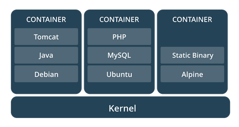

# Docker & ASP.NET Core 2.1
### Miroslav Popović
#### @miroslavpopovic / https://miroslavpopovic.com 

---

## Introduction

TODO

---

## What are containers?

- A stand-alone, executable software packages
- Encapsulates the app and dependencies
- Share the same OS kernel
- Isolate software from surroundings
- Build once, run everywhere
- Shipping containers paradigm

Note:

- https://techcrunch.com/2016/10/16/wtf-is-a-container/
- https://medium.freecodecamp.org/a-beginner-friendly-introduction-to-containers-vms-and-docker-79a9e3e119b
- https://www.sdxcentral.com/cloud/containers/definitions/what-are-containers-like-docker-linux-containers/
- https://www.docker.com/what-container
- The image is from Docker documentation

---

## So, like Virtual Machines?

- No, more lightweight
- Runs as a process
- Smaller
- Faster

Note:

- The image is from Docker documentation

---

## Image vs. container

TODO: Images with animation

Note:

- Container image from https://www.nebulaworks.com/blog/2016/08/04/docker-container-basics-operations-guide-part-1-3/
- A container is launched by running an image. An image is an executable package that includes everything needed to run an application--the code, a runtime, libraries, environment variables, and configuration files.
- A container is a runtime instance of an image--what the image becomes in memory when executed (that is, an image with state, or a user process).

---

## Docker

- Open-Source
- Linux and Windows based
- Easy to use
- Fast
- Docker Hub
- Modularity and scalability
- Docker compose

---

## ASP.NET Core

- Rewritten from scratch
- Open-source
- High performance
- Multi-platform

---

## Demo

TODO: Background image

---

## Docker Swarm / Kubernetes

Note:

- Orchestration
- Image from: https://shadrin.org/nginx/blog/content/docker-swarm-load-balancing-nginx-plus.html

---

## Closing up

TODO: Background image

---

## Scenarios

- Running Linux software on Windows
- Using tools without installation
- Integration 
- Continuous integration
- Continuous delivery
- AWS or Azure deployment
- ...

---

## Problems

- Most of them are not Docker related
- Edge versions
- Caching
- ...
- Community

Note:

Image from: https://www.grupoenconcreto.com/transporte-maritimo-debe-contar-con-seguro/

---

## Further research

- Docs 
  - https://docs.docker.com/ 
  - .NET Core sample - https://docs.docker.com/engine/examples/dotnetcore/ 
  - ASP.NET Core docs - https://docs.microsoft.com/en-us/aspnet/core/host-and-deploy/docker/
- Docker for .NET Developers by Steve Gordon
  - https://www.stevejgordon.co.uk/docker-dotnet-developers-part-1 
- Quick intro to Docker and Docker Compose by João Antunes
  - https://blog.codingmilitia.com/2018/01/31/quick-intro-to-docker-and-docker-compose-angular-aspnetcore-postgres-app
- ASP.NET Core 2.0 in Docker by Mark Rendle
  - https://vimeo.com/233915427 
- Pluralsight courses
  - https://app.pluralsight.com/library/courses/deployment-pipeline-aspdotnet-core-docker/ 
- Sample
  - https://github.com/miroslavpopovic/docker-aspnetcore-sample-1 

---

## Thank you!
### Questions?

#### @miroslavpopovic  
https://miroslavpopovic.com 
